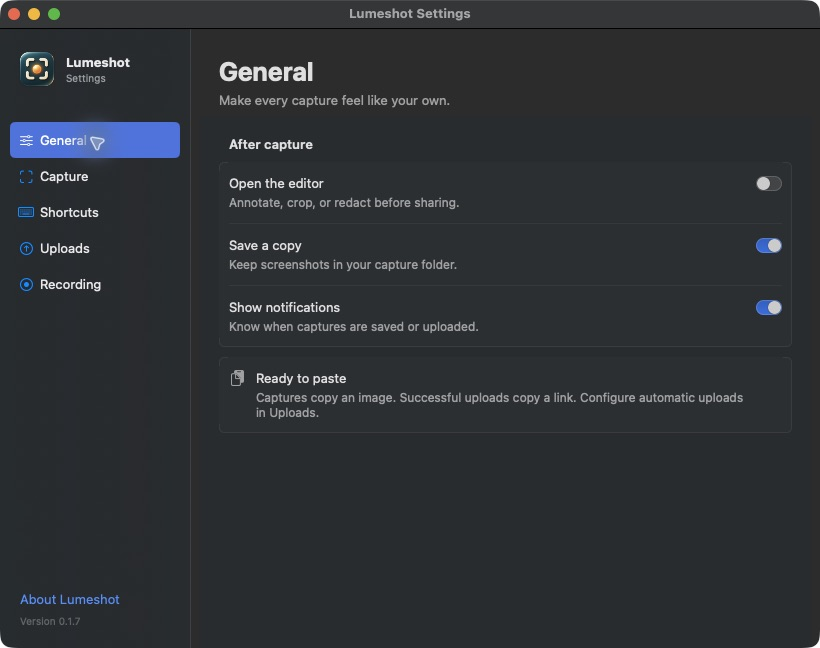
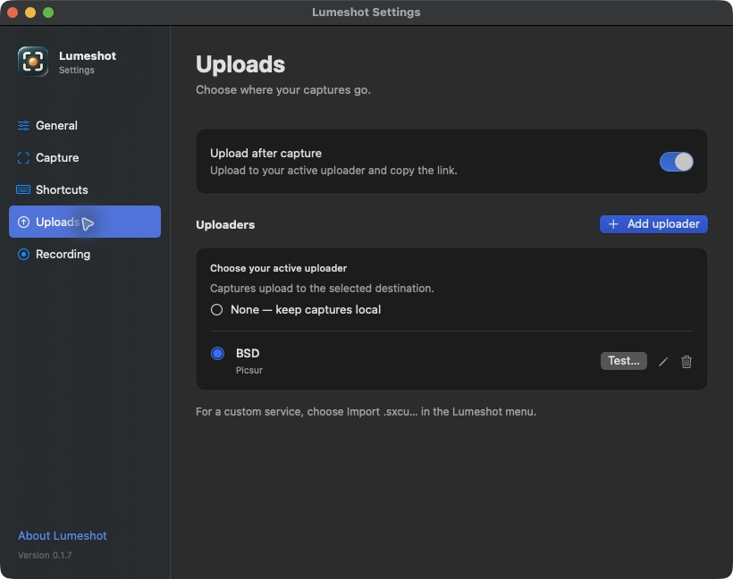
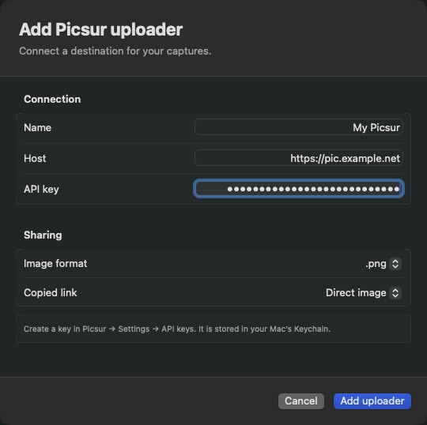
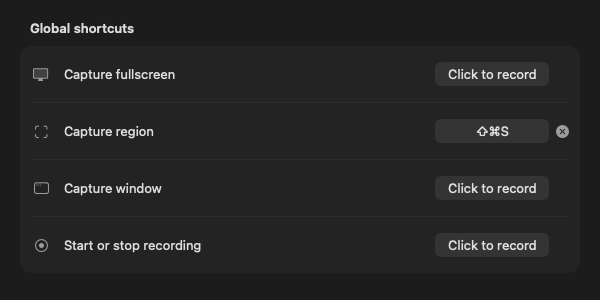

# Lumeshot

A Swift-native screenshot, annotation, upload, and screen-recording tool for macOS (Apple Silicon, macOS 15+). Lumeshot lives in the menu bar, captures with ScreenCaptureKit, and supports `.sxcu` custom uploaders.

**Status:** v0.1.17 is released — capture, a full annotation editor, screen recording, multiple uploader backends, dedicated Settings, and a Developer ID signed + notarized `.dmg`. See **[docs/ROADMAP.md](docs/ROADMAP.md)** for the detailed status, pending manual smokes, and what's next. Local build: `swift build` (see [local development](docs/local-development.md)).

[Download v0.1.17](https://github.com/seitzbg/lumeshot/releases/tag/v0.1.17) · [Changelog](CHANGELOG.md)

## Screenshots

General, Uploads, and uploader-dialog screenshots are from v0.1.7, shown in dark appearance. Settings follows your Mac’s light or dark theme.

Uploader configuration uses grouped fields and a dedicated action bar.

Shortcut controls stay aligned when only some shortcuts are assigned (v0.1.8 layout).

## Features

**Capture** (menu-bar resident, hotkey-driven)
- Fullscreen (all displays), Region (drag-to-select), Window (hover-to-highlight)
- Every capture uploads under its own name, following the filename template even when
  "Save a copy" is off, so nothing overwrites an earlier upload on filename-addressed
  destinations (S3, SFTP, FTP)
- After-capture pipeline: save to disk → copy image → optional upload → history. Upload success copies the uploaded URL, skipping replacement when it detects a newer copy; upload failure leaves the current clipboard intact. Preservation across apps is best effort.
- Permission gating for the TCC Screen Recording grant on first run
- Automatic updates via [Sparkle](https://sparkle-project.org): Lumeshot checks daily and
  on demand (**Check for Updates…**), then downloads, verifies and installs in place

**Editor** (opt-in via "Annotate Before Sharing")
- Vector tools: rectangle, ellipse, line, arrow, freehand
- Redaction & callouts: blur, pixelate, highlighter, text, step-number badges;
  overlapping effects stack rather than replacing each other
- Non-destructive crop; select/move/resize; unlimited* undo/redo (*bounded to the last 50 edits)
- Non-destructive document (base image + ordered shape list) flattened via CoreGraphics on Copy / Save / Upload
- If a blur, pixelate or crop cannot be applied, the export stops and the editor stays
  open with an error — it never falls back to the unredacted or uncropped image

**Screen recording**
- ScreenCaptureKit `.mp4` recording — region, window, or display
- On-demand "Export as GIF…" from the History window (the mp4 is always kept)
- Optional system-audio capture; H.264 / HEVC

**Uploaders**
- Screenshots and screen recordings can target different destinations — useful when
  your image host does not accept video
- **Custom `.sxcu`** — JSON uploader configs; request templating + regex/JSON response-URL extraction
- **Imgur** — anonymous upload (share URL + deletion URL)
- **Picsur** — self-hosted image host; API-key auth, choice of serving format and direct-image vs viewer-page links
- **S3-compatible** — hand-rolled SigV4 (AWS / Cloudflare R2 / MinIO / Backblaze B2); path + virtual-host addressing; optional ACL; custom result-URL domain
- **SFTP** — password or private-key auth (Citadel / SwiftNIO-SSH); host key pinned on first connection and verified thereafter.
  Use an **Ed25519** key: the SSH library can only sign with the legacy
  `ssh-rsa` (SHA-1) algorithm, which OpenSSH 8.8 and newer reject by default,
  so an RSA key that works with the `ssh` command will not authenticate here
  (the upload error says so).
- **FTP / FTPS** — libcurl. A remote directory beginning with `/` is an absolute
  server path; one without is relative to the login directory (as is leaving it
  empty). Many servers chroot the login to `/`, where the two are the same place

**Preferences window** (⌘,)
- Appears in the Dock and app switcher while open; closing Settings returns Lumeshot to menu-bar-only mode.
- Sidebar Settings: General · Capture · Shortcuts · Uploads · Recording, following the system’s light/dark appearance
- Live hotkey recorder (click, press a combo — re-registers instantly, no relaunch)
- Configure multiple uploaders (S3/SFTP/FTP/Imgur/Picsur or imported `.sxcu`), then choose one **Active uploader** on the Uploads page. Adding another uploader preserves your selection.

**History browser**
- Larger thumbnails, search, image/video/failed-upload filters, and Space-bar previews
- Copy image or link, open links, reveal files, and retry or upload a saved capture to a chosen destination
- Separate, explicitly confirmed actions to remove a history entry or delete its remote upload; local files are retained

**Upload feedback and testing**
- Menu-bar upload status and a live status banner in History, including whether the link was copied
- Friendly connection/authentication errors and retries that preserve newer clipboard contents
- A **Test…** action for each saved uploader sends a generated PNG only after you choose **Upload test image**; no screen content is used. Test uploads remain on the server unless you delete them.

**Distribution**
- Compact About window with GitHub and release links, plus bundled open source credits; also accessible from Settings
- Developer ID signed, notarized and stapled `.dmg`, built by a `v*`-tag-triggered GitHub Actions release; hardened runtime with no entitlement exceptions in a signed release. Builds without a Developer ID — local ones, and a fork's unsigned dmg — disable library validation instead, because the hardened runtime cannot satisfy it without an Apple-issued certificate to take a Team ID from, and Sparkle would not load at all. Signing is opt-in on secret presence, so a fork without credentials still publishes an (ad-hoc) dmg. One-time setup: `scripts/setup-developer-id.sh` — see `docs/RELEASING.md`

## Security

Secrets (API keys, Picsur API keys, S3 keys, SFTP/FTP passwords and private keys) are stored **only in the login Keychain** (`org.lumeshot.app`), never in `settings.json`.

For imported `.sxcu` custom uploaders the guarantee is narrower, because the format lets a credential sit anywhere. Two surfaces are protected unconditionally — the JSON body template, and a `RequestURL` carrying a query string or user-info, both stored in full. Headers, arguments and query parameters are matched against a key-name heuristic (`authorization`, `token`, `api_key`, `signature`, …). That heuristic is deliberately over-eager, but a secret under a genuinely innocuous key can still reach `settings.json` — treat an untrusted `.sxcu` accordingly.

Upload failures are logged to `~/Library/Logs/Lumeshot.log` without the server's
response body, which can echo an API key, a signed URL or a deletion token back
on an error. The status code and the app's own transport messages are kept.

## License

[GPL-3.0](LICENSE).
