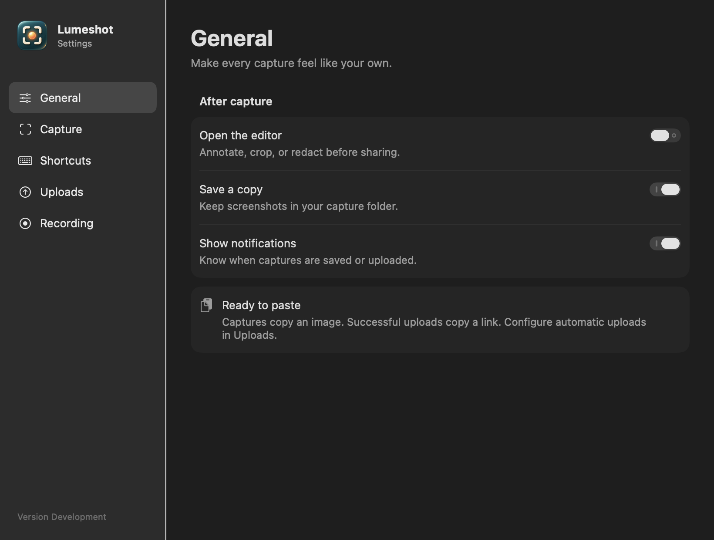
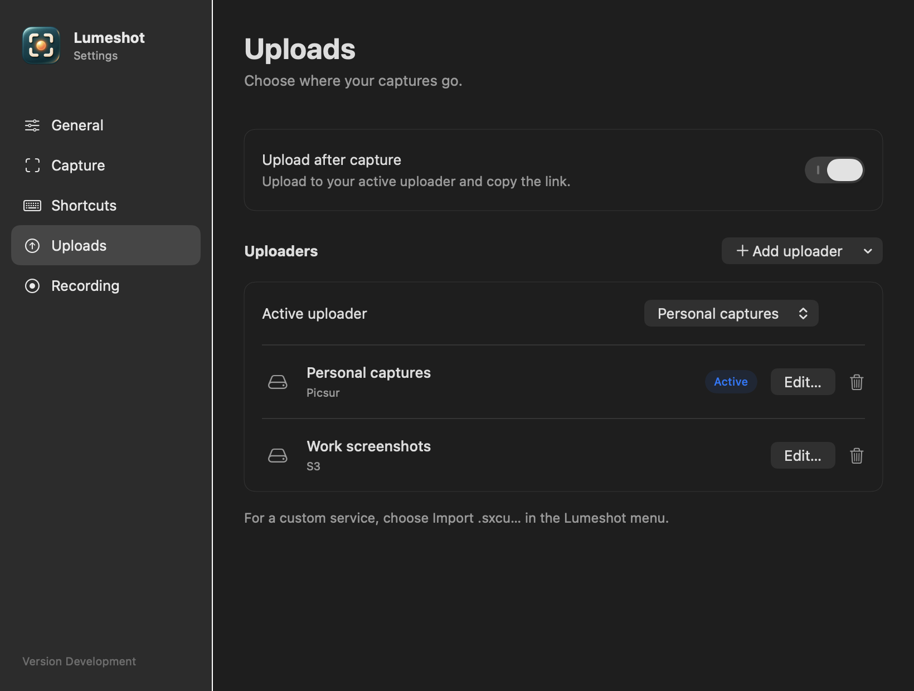
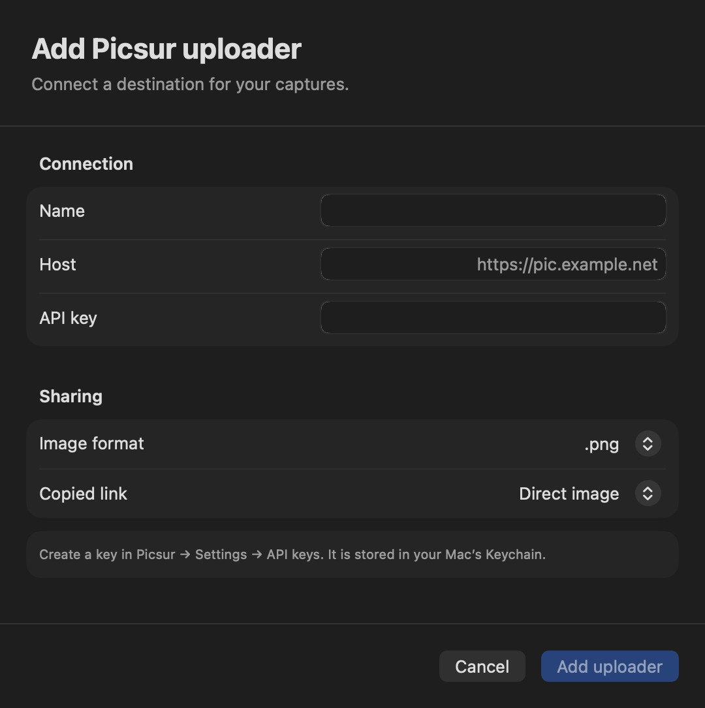

# Settings visual refresh

The app now uses a sidebar for General, Capture, Shortcuts, Uploads, and Recording.
Grouped native controls provide consistent spacing and light/dark appearance.
The window starts at 820 × 620, supports a 760 × 560 minimum, and restores its
saved frame instead of recentering on each launch.

Uploader configuration uses a single Add uploader menu and grouped sheets with
fixed action bars. Long S3/SFTP forms scroll. The active uploader remains an
explicit selection, independent of editing an uploader.

The app icon source is `Resources/AppIcon.png`; `bash scripts/build-icon.sh`
rebuilds the multi-resolution `Resources/AppIcon.icns` used by the bundle.

## Previews

Rendered from the actual SwiftUI views with temporary sample settings and no real
credentials. All five pages were inspected at normal and minimum sizes in light
and dark appearance; all five provider forms and the empty Uploads state were
also rendered. These are layout checks, not end-to-end upload or Keychain tests.

## Validation

- Existing suite: 386 tests in 79 suites passed; seven Screen Recording-dependent
  hardware tests skipped on the local machine.
- Release build and local bundle signature verification passed. The bundle
  contains the expected icon and declares it in Info.plist.
- Plist, shell syntax, and whitespace checks passed.
- Full keyboard navigation, sheet interactions, and a real upload remain manual
  checks in `smoke-prefs.md`.

Release descriptions now come from `docs/releases/<tag>.md`. Published notes
through v0.1.5 were cleaned up; notes for v0.1.6 are prepared for the next release.
